# Benchmarking various FFT implementations
FFTW3 run in FFTW_MEASURE mode. FFTW_PATIENT is death, and I wanted to give it a fair shot with the default. It's compiled with
```
./configure --enable-openmp --enable-shared=yes --enable-sse2 --enable-avx\
    --enable-avx2 --enable-avx512 --disable-kcvi --disable-vsx \
    --disable-avx-128-fma --enable-fma
```
using `gcc 12.2.0`. All benchmarks are compiled with native instructions enabled: `-march=native -O3`.

| MKL      | FFTW   | KISS    | Pocket   | DUCC   | Sleef |
|----------|--------|---------|----------|--------|-------|
| 2023.1.0 | 3.3.10 | 131.1.0 | 81d171a6 | 0.32.0 | 3.5.1 |


## Single threaded results
### 1D
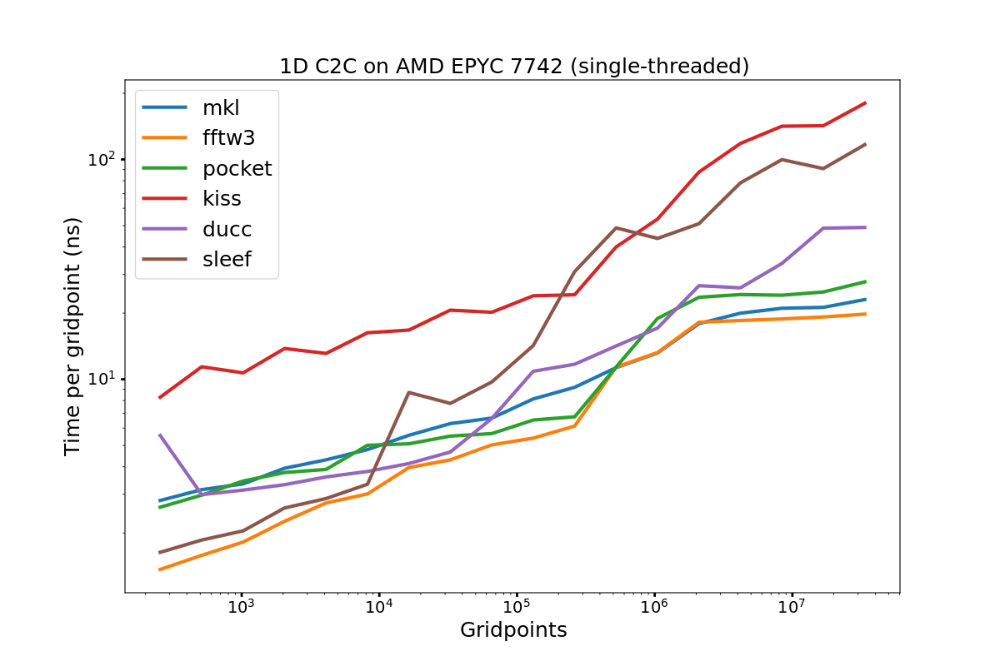

<!--  -->

### 2D
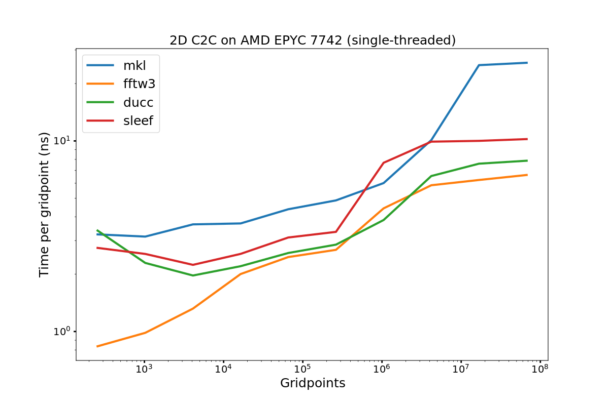

<!-- 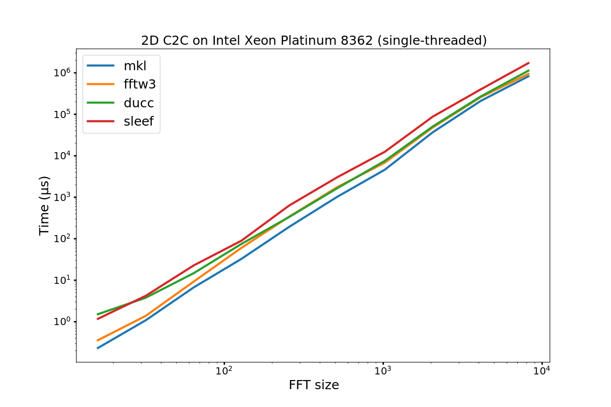 -->

### 3D
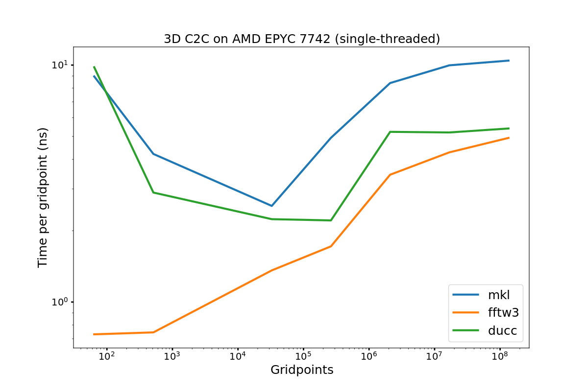
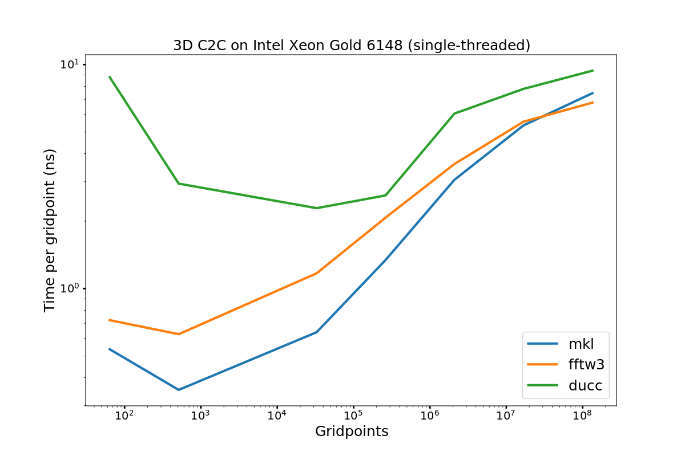
<!-- 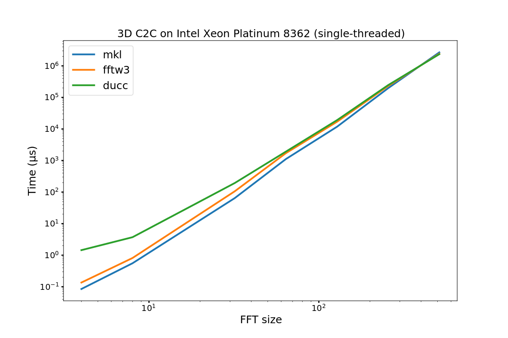 -->


## Multi threaded results
All benchmarks are run on a single socket, using all available cores on that socket. I.e.

```
# Rome: 64 cores
# Skylake: 20 cores
# Icelake: 32 cores

export OMP_NUM_THREADS=$((nproc / 2))
export OMP_PROC_BIND=spread
export OMP_PLACES=threads

taskset -c 0-$((OMP_NUM_THREADS-1)) blah_bench args
```

Note that KISS has openmp enabled, but I didn't do a separate build for it. Given its performance, I am happy to ignore it. So the following benchmarks are just for mkl/fftw3.

### 1D
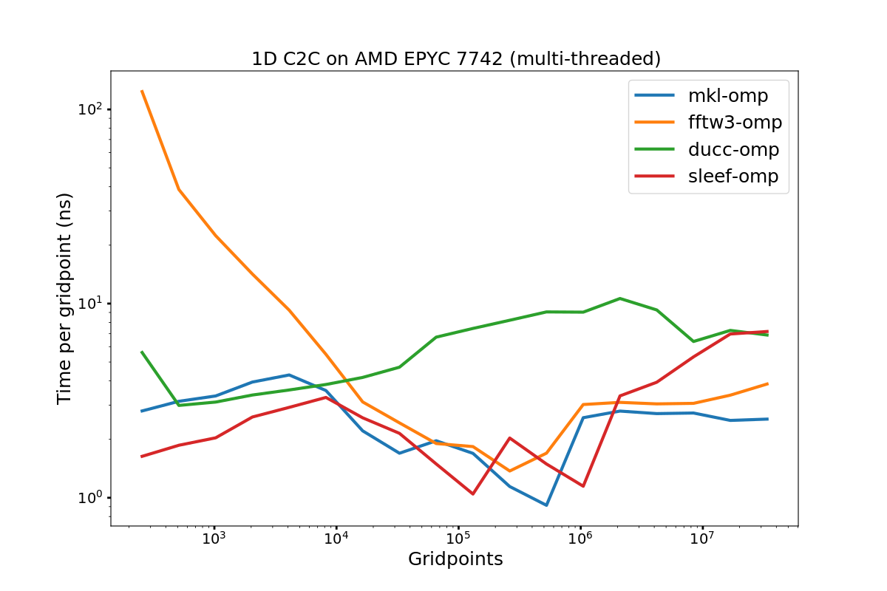

<!--  -->

### 2D
Note the AMD measurements are not in error. This really happens consistently. MKL is very
unhappy with more than 16 threads for these particular sizes in 2D.

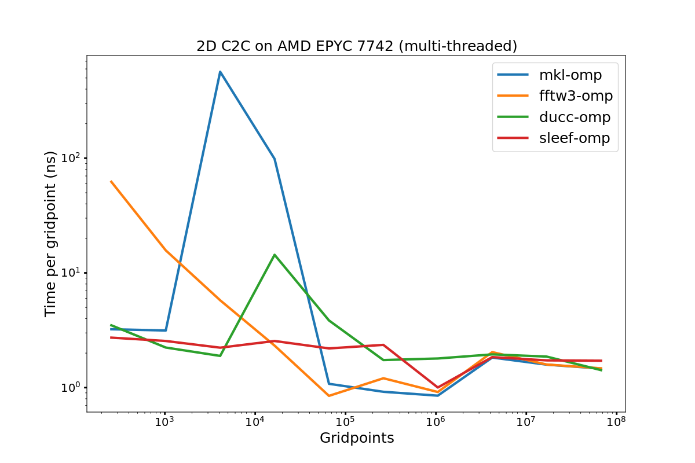

<!-- 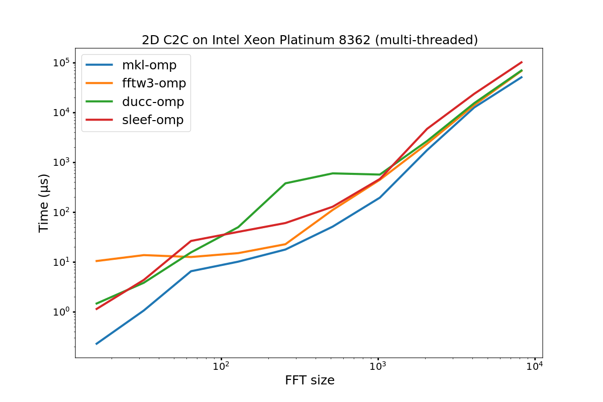 -->

### 3D
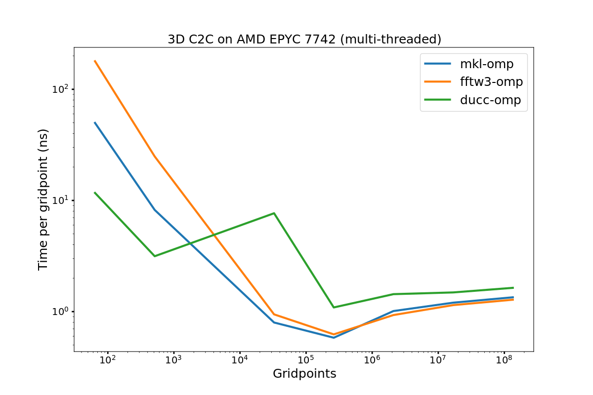
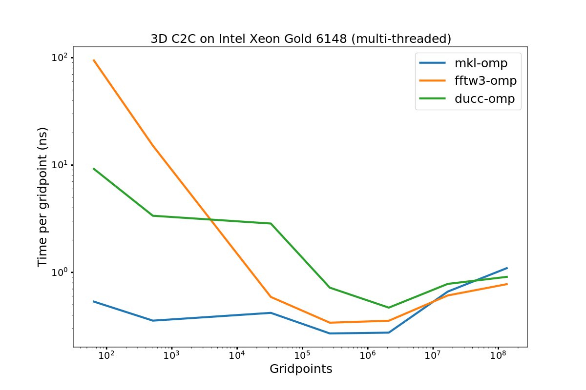
<!-- 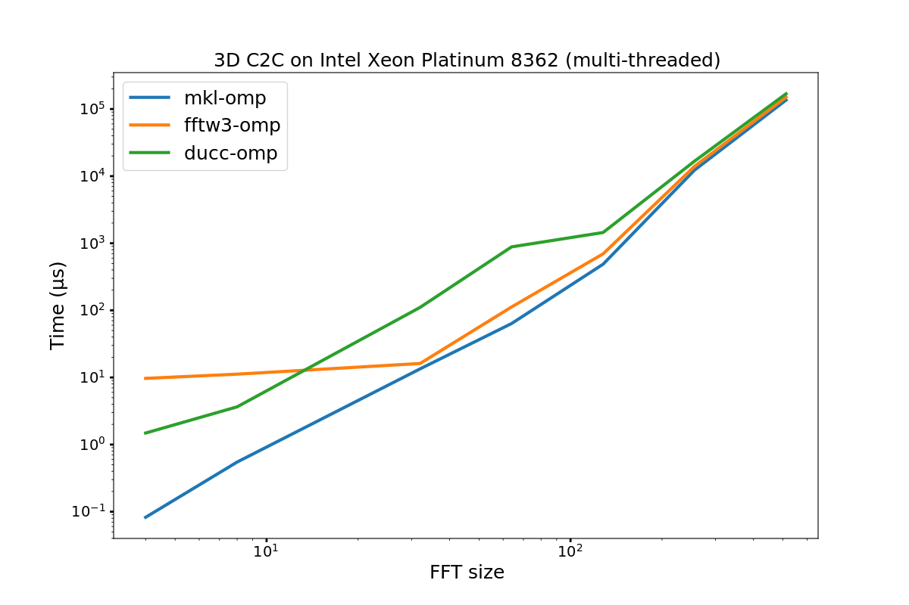 -->
